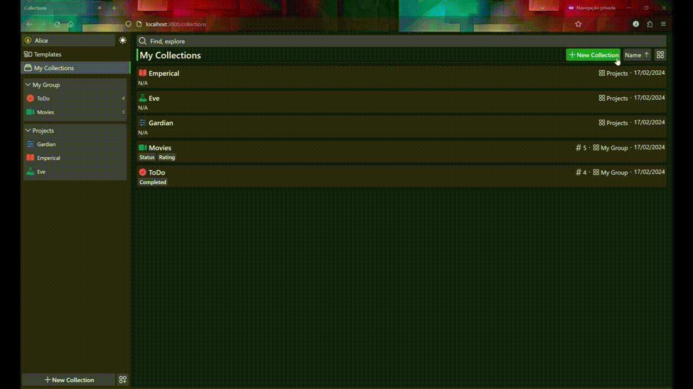
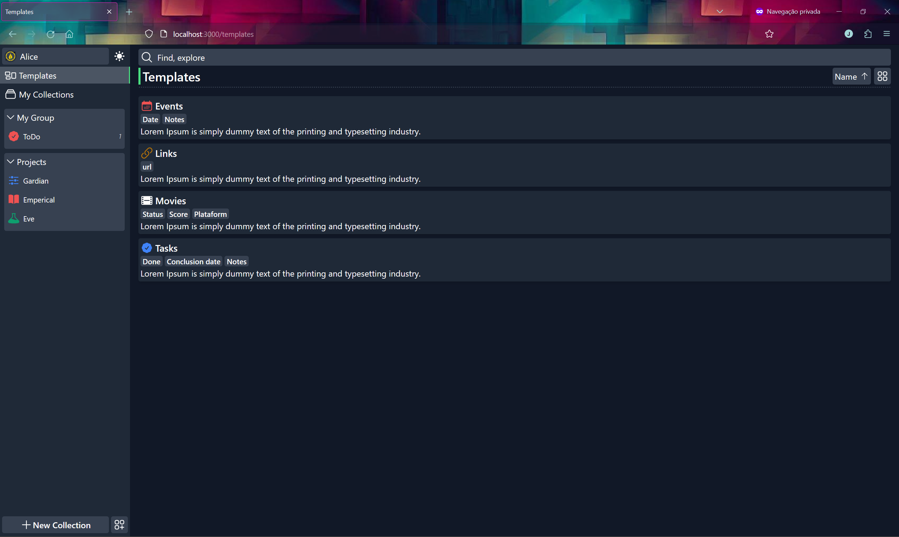
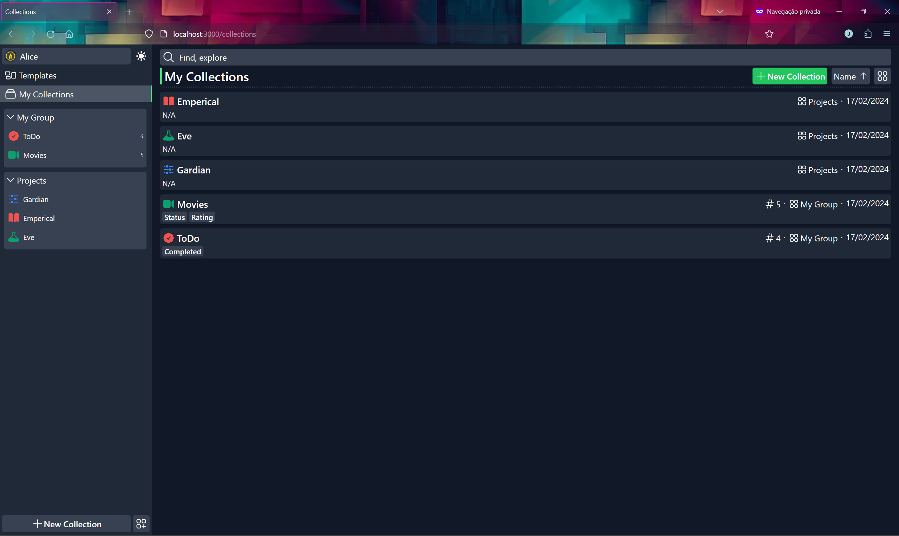
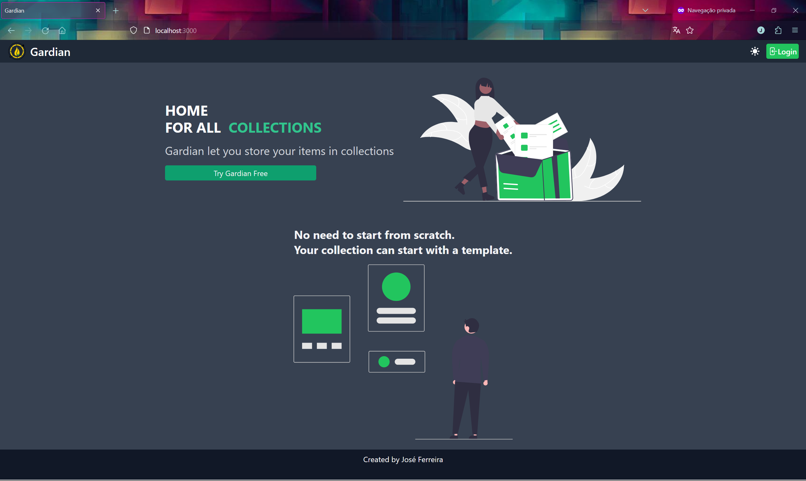

<p align="center">
 
 <h1 align="center">
  Gardian
 </h1>
</p>

> A newer alternative to [Gardian](https://github.com/M1NMAX/gardian), called [Stackbold](https://github.com/M1NMAX/stackbold), has been developed using [Svelte](https://svelte.dev/).

Gardian is a web application created to streamline organization by functioning as a centralized repository for all collections. Whether users require simple to-do lists or personalized collections such as project management, movie, or series lists, Gardian provides intuitive features for efficient organization and management. Users can customize categories to their liking; for example, within movie collections, they can define categories like "watched," "watching," and "plan to watch," enabling tailored collections that cater to their specific preferences.



## Technologies:

- NextAuth: Used for user management and authentication functionalities.
- MongoDB: Utilized for storing application data, including user-generated content.
- Prisma: Used for defining the database schema and interacting with the database.
- Next.js: Utilized for back-end API development,
- Rectjs and flowbite: Utilized to create the UI and deliver enhanced UX.

## Installation and Exectuion

```bash
# clone the repo
git clone https://github.com/M1NMAX/gardian

# Navigate to clonned folder and Install dependencies
cd gardian && npm install
```

Set up the environment variables described in `.env.example`

```
# Generate prisma client and seed the data base
npx prisma generate && npx prisma db seed

# run the app
npm run dev
```

## Extra pictures




